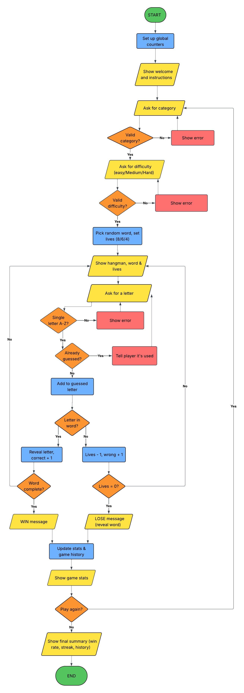

Hangman Game in Python

This is my first Python project for the Rockborne Data Analyst training programme. I decided to build a text-based version of Hangman because it let me use most of what we've covered so far, like strings, lists, dictionaries, sets, loops, functions and error handling.

The idea is simple: you pick a category and a difficulty, then try to guess the hidden word one letter at a time. Every wrong guess costs you a life and adds another part to the hangman. If you guess the word before your lives run out, you win.

What the game includes

- 3 word categories: Football, Countries and Animals, with 10 words in each
- 3 difficulty levels: Easy (8 lives), Medium (6 lives) and Hard (4 lives)
- A hangman drawing that builds up with every wrong guess. I scaled it so the full body always appears on your last life, whichever difficulty you pick
- Input checking, so the game doesn't crash if you type something unexpected (e.g. a number, a symbol, more than one letter or a letter you've already tried)
- Statistics that are tracked using global counters and shown after every game
- A game history and final summary that appear when you decide to stop playing

What you need

- Python 3
- Jupyter Notebook (or JupyterLab)
- No extra libraries. The only import is random, which comes built into Python

How to run it

1. Download or clone this repository.
2. Open Hangman_Game.ipynb in Jupyter Notebook.
3. Click Kernel, then Restart & Run All.
4. Scroll down to the bottom of the notebook and follow the instructions that come up.

How to play

1. Choose a category by typing its number or name (e.g. 1 or football).
2. Choose a difficulty in the same way (e.g. 3 or hard).
3. Guess a letter by typing it and pressing Enter. If the letter is in the word, it shows up in every position it appears in. If it isn't, you lose a life and the hangman drawing gets bigger.
4. You win if you reveal the whole word before running out of lives.
5. You lose if your lives hit 0. The game then shows you what the word was.
6. After each game, your stats are shown and you can choose whether to play again or stop.

What happens if you type something wrong

I wanted to make sure the game never crashes, so every input gets checked first:

- A single new letter is accepted
- If you type nothing, it says "You didn't type anything - please enter a letter."
- If you type more than one character, it says "Please enter only ONE letter at a time."
- If you type a number or symbol, it says "That's not a letter - numbers and symbols aren't allowed."
- If you type a letter you've already guessed, it tells you it's already been used (and you don't lose a life)

Capital letters work too, as they're converted to lower case automatically. The category, difficulty and play-again menus also reject anything that isn't one of the options.

Statistics

The game keeps track of the following using global counters:

- Games played: how many games you've played in total
- Wins and losses: how many games you've won and lost
- Win rate: the percentage of games you've won
- Correct guesses: the total number of correct letters across all games
- Wrong guesses: the total number of wrong letters across all games
- Current streak: how many games in a row you've won so far
- Best streak: your longest winning streak

When you stop playing, the final summary shows all of these along with a history of each game (the word, category, difficulty, result and number of guesses).

How the code is organised

I split the code into functions so that each one has a single job. This made it much easier to test each part as I went along and to fix things when they didn't work:

- get_random_word() picks a random word from the chosen category
- display_word() shows the word with blanks for any letters not guessed yet
- draw_hangman() returns the right hangman drawing based on how many lives have been lost
- show_instructions() prints the welcome message and the rules
- get_choice() asks the player to pick from a menu and checks the answer is valid (used for the category, difficulty and play-again questions)
- get_valid_guess() asks for a letter and checks it's valid
- play_round() runs one full game and returns whether the player won
- update_stats() updates the global counters and adds the game to the history
- show_stats() prints the current stats
- show_final_summary() prints the final stats and the game history
- main() controls the overall flow of the game, including the play-again loop

Flowchart

Before writing any code, I planned out the logic of the game with this flowchart:

Files in this repository

- Python_04_01_Project_PythonGameDevelopment.ipynb: the game itself (Jupyter Notebook)
- hangman_flowchart.png: the flowchart showing the game's logic
- README.md: this file

What I'd add next

If I had more time, I'd like to:

- let the player guess the whole word in one go
- add more categories and words
- add a hint option that costs a life
- build a proper graphical version using Tkinter

Author

Zaid Budi
